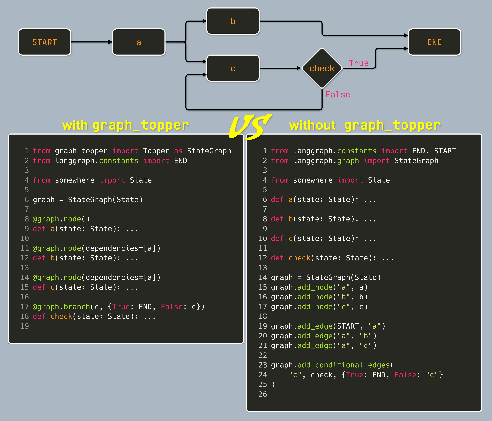

# graph_topper

[](https://pypi.org/project/graph_topper/)

`graph-topper` is a small extension to the `langgraph` library that allows for graph definitions via decorators, 
bringing flow-control and logic to one place.

Mostly a hobby project, but aims to fulfill all expectations of a fully fledged python library, such as clean code,
tests, docs and a pypi release.

---

## ✨ Features
- Define node logic and node connections in one place
- Stops circular references in the graph via native python syntax (node directionality is implied by the order in which
the methods are defined)
- More compact graph definition (define node and incoming edges in one line)
- Avoids error-prone string references (by using method names by default)
- Retains all functionality of `langgraph`
 
---

## 📦 Installation

```bash
pip install graph_topper
```

## ⚡ Quick Examples
Comparing `graph_topper` to pure `langgraph`


## 🤝 Contributing

Contributions are welcome! Feel free to open issues, suggest improvements, or submit pull requests.
